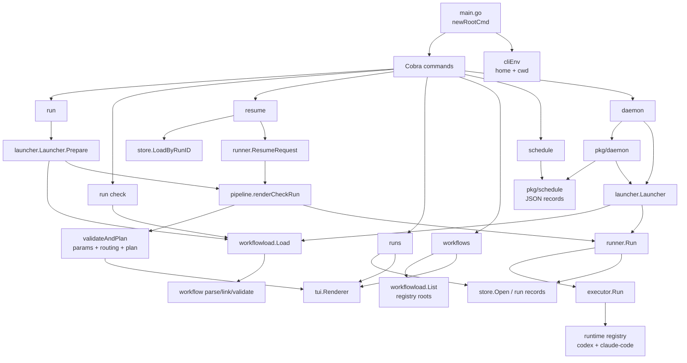
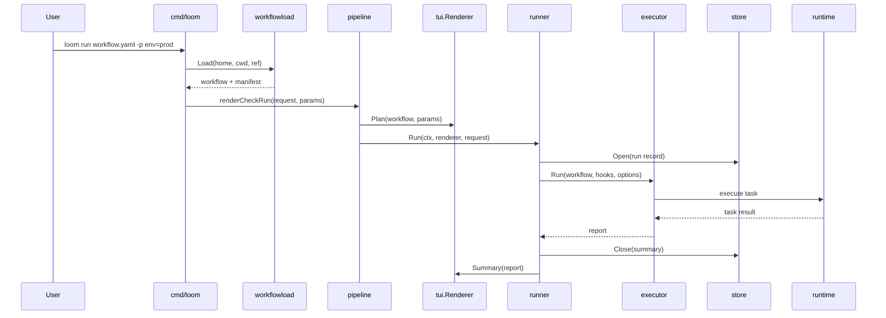
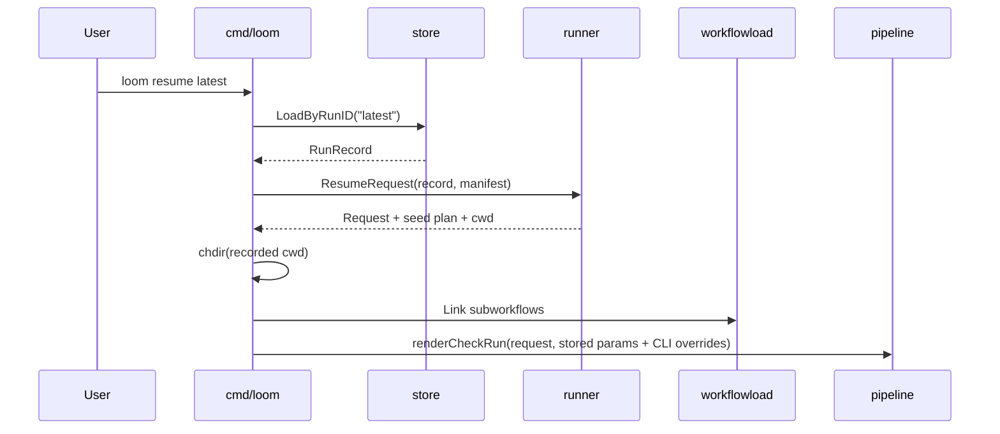
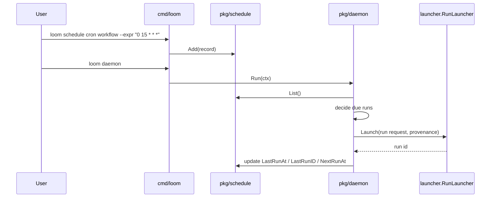

# cmd/loom Implementation

`cmd/loom` is CLI adapter. It wires commands, parses flags, resolves
`$LOOM_HOME` and current working directory, then delegates real work to packages.

## Command Surface

### `main.go`

Entrypoint. `main` calls `newRootCmd().Execute()`.

`newRootCmd` creates root Cobra command, resolves invocation environment in
`PersistentPreRunE`, then installs command tree:

- `run`
- `resume`
- `runs`
- `workflows`
- `schedule`
- `daemon`

Blank imports register runtime backends:

- `pkg/runtime/claudecode`
- `pkg/runtime/codex`

`interruptContext` creates shared SIGINT/SIGTERM cancellation context for run
pipeline and daemon.

### `home.go`

Resolves Loom home:

- `$LOOM_HOME` when set
- `$HOME/.loom` otherwise

It returns absolute path and creates directory.

`cliEnv` carries resolved `home` and `cwd` into all command handlers.

### `cliargs.go`

Small flag helpers.

`addParamFlags` registers repeatable `-p/--param key=val`. Uses
`StringArrayVarP`, so commas in values stay intact.

`firstArg` extracts optional workflow filters.

## Run Path

### `runworkflow.go`

Handles `loom run <workflow>`.

Flow:

1. Cobra parses workflow arg and flags.
2. `workflowload.Load(home, cwd, path)` resolves and parses workflow.
3. `renderCheckRun` validates, prints plan, then runs.

`--resume-latest` switches to `doRunResumeLatest`, which loads current YAML
from disk but seeds completed task outputs from latest run record.

### `check.go`

Handles `loom run check <workflow>`.

Uses same validation and plan rendering path as `run`, but stops before
`runner.Run`.

Missing required params are advisory here, so `check` can show what workflow
needs without hard failing immediately.

### `pipeline.go`

Shared run/check preflight.

`validateAndPlan`:

1. Parses CLI params.
2. Resolves params against workflow defaults and optional stored params.
3. Validates routing with resolved params.
4. Renders plan through `tui.Renderer`.
5. Returns resolved params for execution.

`renderCheckRun`:

1. Resolves cwd if caller did not provide one.
2. Creates renderer.
3. Calls `validateAndPlan` with hard validation.
4. Creates interrupt-aware context.
5. Calls `runner.Run`.

This is key invariant: `loom run` always performs check phase before execution.

## Resume Path

### `resume.go`

Handles:

- `loom resume <run-id>`
- `loom run --resume-latest <workflow>`

`doResume` loads stored run record with `store.LoadByRunID`, then runs from
stored manifest.

`doRunResumeLatest` loads current workflow YAML from disk, then loads latest
record for same workflow ID. Current workflow body wins. Previous run provides
seed outputs and original params.

`prepareResumedRequest` delegates seed construction to `runner.ResumeRequest`.
When record has cwd, CLI performs `os.Chdir` itself because cwd mutation is
process-global and intentionally kept out of `pkg/runner`.

`runFromRecord` re-links subworkflows from disk, annotates plan with seeded
tasks, then uses shared `renderCheckRun`.

## Listing And Inspection

### `runs.go`

Handles:

- `loom runs [workflow]`
- `loom runs ls [workflow]`
- `loom runs show <run-id>`

Reads run records through `pkg/store`.

Renders via `pkg/tui`:

- interactive browser on rich terminal
- plain table when piped, `--plain`, or no runs exist
- full stored run, summary, or single task body for `show`

### `workflows.go`

Handles:

- `loom workflows ls`
- workflow shell completion

Delegates registry discovery to `workflowload.List`, then renders table with
`tui.WorkflowsTable`.

Registry roots:

- nearest local `.loom/workflows` roots from cwd upward
- global `$LOOM_HOME/workflows`

## Schedule And Daemon

### `schedule.go`

Defines schedule command tree:

- `schedule cron <workflow>`
- `schedule at <workflow>`
- `schedule ls [workflow]`
- `schedule rm <id>`
- `schedule enable <id>`
- `schedule disable <id>`
- `schedule sync [workflow]`

Schedule records are consumed by `loom daemon`.

### `schedule_create.go`

Validates workflow and params before writing schedule record.

`loadAndResolve` loads workflow, parses CLI params, resolves and validates
params, then stores CLI-supplied params in schedule record. Daemon resolves
them again at run time against the current workflow.

### `schedule_manage.go`

Thin wrappers around `pkg/schedule`:

- list
- remove
- toggle enabled bit

### `schedule_sync.go`

Reconciles inline workflow `schedule:` blocks into schedule store.

With workflow arg: syncs one workflow.

Without arg: walks all registry workflows, skipping broken ones with message so
single bad workflow does not abort whole sweep.

### `daemon_cmd.go`

Handles:

- `loom daemon`
- `loom daemon install`

`loom daemon` creates a `pkg/daemon` instance and runs its foreground loop.

`daemon install` delegates launchd/systemd unit creation to
`internal/daemoninstall`.

## Package Boundaries

`cmd/loom` owns command UX:

- Cobra command tree
- flags and args
- stdout/stderr writer choice
- cwd restore on resume
- signal cancellation
- handoff to package APIs

`pkg/workflowload` owns workflow references:

- path vs registry name
- absolute path normalization
- workflow read and parse
- subworkflow linking
- registry listing

`pkg/workflow` owns workflow model and validation:

- YAML parsing
- params
- routing
- DAG rules
- subworkflow linking contracts

`pkg/tui` owns presentation:

- plan rendering
- run progress
- summaries
- run browser
- tables

`pkg/runner` owns run lifecycle:

- open run record
- load cross-run state
- seed resumed tasks
- call executor
- write summary
- persist state

`pkg/executor` owns execution engine:

- task DAG execution
- hooks
- params/state substitution
- runtime dispatch

`pkg/runtime/*` owns actual backend implementations:

- Codex runtime
- Claude Code runtime

`pkg/store` owns run persistence:

- run records
- latest links
- run listing
- run lookup
- cross-run state

`pkg/schedule` owns schedule persistence and validation:

- schedule JSON files
- cron/one-off trigger validation
- next-run computation
- inline schedule sync

`pkg/daemon` owns daemon behavior:

- schedule-file watch and next-run timer loop
- catch-up handling
- overlap policy
- scheduled workflow run requests through `launcher.RunLauncher`

`pkg/launcher` owns shared launch setup:

- workflow ref loading
- param and routing validation
- per-run logs for scheduled runs
- runner invocation with provenance

## Fresh Run Sequence

## Resume Sequence

## Scheduled Run Sequence

